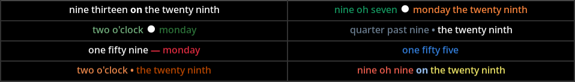

<div style="display:flex; align-items:center; gap:0.75rem;">
   
   <div>
      <h2 style="margin:0; line-height:1;">Text Clock v1.1.0</h2>
      <div style="color:var(--secondary-text-color,#666);">A simple text clock for the GNOME Shell</div>
   </div>
</div>



[](https://github.com/wtbenica/text-clock/releases)
[](https://github.com/wtbenica/text-clock/main/LICENSES/GPL-3.0-or-later.txt)
[](https://github.com/wtbenica/text-clock/graphs/contributors)
[](https://github.com/wtbenica/text-clock/issues)


### New in v1.1.0

- Accent color themes and custom color options
- Enhanced preferences UI and dedicated color settings
- Divider customization and improved Spanish translations

See the full release notes: [RELEASE_NOTES.md](RELEASE_NOTES.md)

### Overview

**Text Clock** modifies the GNOME Shell top bar clock to show the time as text.

#### Key Features

- **GNOME Shell Integration:** Replaces the standard clock in the top bar.
- **Time Format Options:** Choose between relative minutes ("ten to three", "five past noon") or hours and minutes ("four thirty", "eleven oh seven").
- **Optional Date Display:** Time-only or time and date display.
- **Fuzziness:** Displays the exact time or fuzzy time, rounded to five, ten, or fifteen minute intervals.

#### Compatibility

**Text Clock** is compatible with GNOME Shell 45 and later.

### Getting Started

#### Installation

You can install the extension from the GNOME Extensions website or manually from the source code.

#### With Extensions Manager

The simplest way to install the extension is using [_Extensions Manager_](https://github.com/mjakeman/extension-manager). It can install, enable, disable, and configure extensions directly.

#### From AUR (Arch Linux)

Arch Linux users can install the extension from the AUR:

```bash
# Using an AUR helper (recommended)
yay -S gnome-shell-extension-text-clock

# Or manually
git clone https://aur.archlinux.org/gnome-shell-extension-text-clock.git
cd gnome-shell-extension-text-clock
makepkg -si
```

This installs the extension system-wide and is managed by the package manager.

#### From extensions.gnome.org

This extension is available on [extensions.gnome.org](https://extensions.gnome.org/extension/7186/text-clock/). To use the site, you'll need to install a couple of components:

- The browser extension
  - _Chrome-based browsers:_ [Chrome Web Store](https://chrome.google.com/webstore/detail/gnome-shell-integration/gphhapmejobijbbhgpjhcjognlahblep).

  - _Firefox:_ [Mozilla Add-ons site](https://addons.mozilla.org/firefox/addon/gnome-shell-integration/).

  - _Opera:_ [Deactivated](https://gnome.pages.gitlab.gnome.org/gnome-browser-integration/images/opera-conversation.png). Use one of the manual methods below.

- The [native host connector](https://gnome.pages.gitlab.gnome.org/gnome-browser-integration/pages/installation-guide.html) so the site can enable/disable extensions.

#### From a ZIP File

You can download the latest release of the extension as a ZIP file:

1. Download this [ZIP file (v1.1.0)](https://github.com/wtbenica/text-clock/releases/download/v1.1.0/text-clock@benica.dev.zip) from Github.
2. Create the extension directory: `mkdir -p ~/.local/share/gnome-shell/extensions/text-clock@benica.dev`
3. Extract the ZIP file to the extension directory: `unzip text-clock@benica.dev.zip -d ~/.local/share/gnome-shell/extensions/text-clock@benica.dev`
4. Restart GNOME Shell for the changes to take effect. On Wayland, log out and back in. On X11, press Alt+F2, type `r`, and then press Enter.

##### Verifying the Download

For added security, you can verify the integrity and authenticity of the downloaded ZIP file using GPG signatures. This ensures the release was signed by the developer and hasn't been tampered with.

1. **Install GPG** (if not already installed):

2. **Download and import the public key**:

   ```bash
   # Download from the repository
   wget https://raw.githubusercontent.com/wtbenica/text-clock/main/ci-pub.asc

   # Import into your GPG keyring
   gpg --import ci-pub.asc
   ```

3. **Verify the ZIP file** (replace `X.Y.Z` with the version number):

   ```bash
   gpg --verify text-clock@benica.dev-X.Y.Z.zip.sig text-clock@benica.dev-X.Y.Z.zip
   ```

   - **Success**: You'll see "gpg: Good signature from [key details]".
   - **Failure**: Indicates a potential issue—re-download or check the key fingerprint.

The public key fingerprint is `50483D39B066B9CAC0B0189A433660C4BA3A31AC`. You can download the full public key from the repository's [`ci-pub.asc`](https://raw.githubusercontent.com/wtbenica/text-clock/main/ci-pub.asc) file to import it.

#### From Source

###### Required Dependencies

To use the Makefile for installation, you will need the following dependencies:

- `make` (for running the Makefile)
- `node`
- `yarn` (v4.x)
- `perl`
- `glib-compile-schemas`

You can verify your system has the required tools by running `make check-deps`.

###### Pre-Installation Notes:

- **Backup**: As a precaution, you may want to backup your existing GNOME Shell extensions before installation.

- **Path Expansion**: The Makefile uses `$(HOME)` for path expansion. Please ensure that your system correctly expands `$(HOME)` to your home directory.

###### Installation

1. The source files are hosted on GitHub. You can download the source files as a [ZIP file](https://github.com/wtbenica/text-clock/archive/refs/heads/main.zip) or clone the repository using Git:

   | Method     | Command                                                |
   | ---------- | ------------------------------------------------------ |
   | HTTPS      | `git clone https://github.com/wtbenica/text-clock.git` |
   | SSH        | `git clone git@github.com:wtbenica/text-clock.git`     |
   | GitHub CLI | `gh repo clone wtbenica/text-clock`                    |

   Refer to [GitHub's documentation on cloning repositories](https://docs.github.com/en/get-started/getting-started-with-git/about-remote-repositories) for more information.

2. Navigate to the cloned or extracted directory that contains the Makefile and run:

   **For user installation (recommended):**

   ```bash
   make install
   ```

   **For system-wide installation:**

   ```bash
   sudo make install-system
   ```

   This compiles the extension and installs it into your GNOME Shell extensions directory.
   - `make install` installs to `~/.local/share/gnome-shell/extensions/` (user-only)
   - `make install-system` installs to `/usr/share/gnome-shell/extensions/` (all users)

   Restart GNOME Shell for the changes to take effect. On Wayland, log out and back in. On X11, press Alt+F2, type `r`, and then press Enter.

3. After installation, you may delete the cloned repository. To only clean up the build artifacts, run:
   ```bash
   make clean
   ```

###### Uninstallation

To uninstall the extension:

```bash
make uninstall           # Remove from user directory
sudo make uninstall-system  # Remove from system directory (if installed system-wide)
```

#### Managing the Extension

###### GUI Method

You can use a GUI tool like [_Extensions Manager_](https://github.com/mjakeman/extension-manager) or _GNOME Extensions_ to disable, enable, uninstall, and configure extensions.

###### Command Line

To disable the extension (but leave it installed), run:

```bash
gnome-extensions disable text-clock@benica.dev
```

To enable the extension from the command line:

```bash
gnome-extensions enable text-clock@benica.dev
```

To access the preferences, run:

```bash
gnome-extensions prefs text-clock@benica.dev
```

To remove the extension completely, run:

```bash
gnome-extensions uninstall text-clock@benica.dev
```

---

### Contributing

Contributions, including bug reports and feature suggestions, are welcome. Please use the issue tracker or submit a pull request.

---

### License

Text Clock is open-sourced under the GNU General Public License v3.0 or later (GPL-3.0-or-later). See the LICENSE file for more details.
